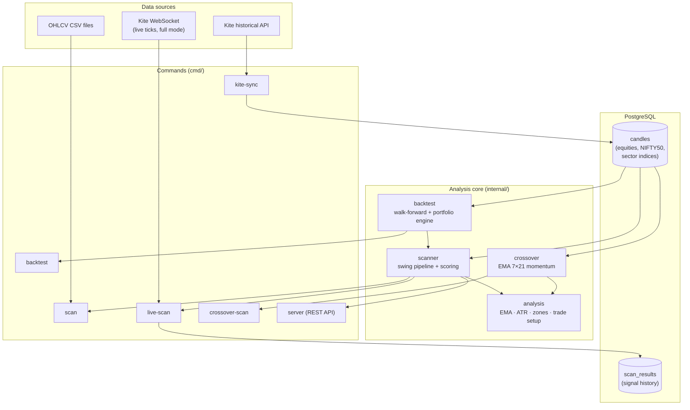
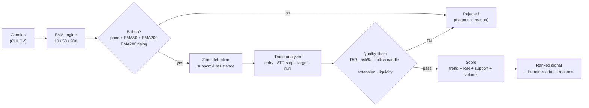
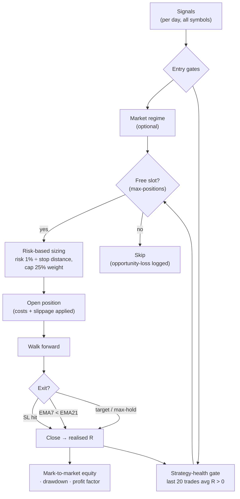

# Stock Market Analysis Engine

[](https://github.com/sahiltyagi27/stock-market-analysis/actions/workflows/ci.yml)
[](https://go.dev)

A backend engine written in Go that automates stock-market technical analysis — from raw OHLCV candle data to ranked, explainable trade opportunities — **and** rigorously back-tests those signals as a realistic, cost-aware portfolio.

It has two halves:

1. **Scanner** — turns candle data into ranked, explainable trade signals (offline, or live via the Kite WebSocket).
2. **Research / backtest engine** — replays the strategy as a portfolio (shared capital, position cap, transaction costs, risk-based sizing, regime gating) to measure what actually works. The full study lives in **[ANALYSIS.md](ANALYSIS.md)**.

---

## Overview

Retail investors cannot manually scan hundreds of stocks every day — and even a
good signal is worthless if the *portfolio construction* around it is poor.

This engine solves both. The scan pipeline runs automatically:

1. Loads historical OHLCV candles (CSV or PostgreSQL)
2. Calculates exponential moving averages to determine trend
3. Detects support and resistance zones from price structure
4. Generates trade setups with entry, stop-loss, and target
5. Scores and ranks opportunities across a universe of ~500 symbols
6. Returns explainable reasons for every signal

…and the **walk-forward backtest** then proves (or disproves) the strategy on
years of history with realistic costs. The headline research result: a
**strategy-health regime filter** plus **risk-based position sizing** beat the
index on a risk-adjusted basis where naive market filters failed (see
[ANALYSIS.md](ANALYSIS.md)).

---

## Features

- ✅ **EMA Engine** — 10, 50, and 200-period exponential moving averages
- ✅ **Support Detection** — local minima clustering into price zones
- ✅ **Resistance Detection** — local maxima clustering into price zones
- ✅ **Trade Analyzer** — entry, stop-loss, target, risk, reward calculation
- ✅ **Risk/Reward Grading** — Poor / Fair / Good / Excellent quality grades
- ✅ **Scanner Engine** — bullish filter, multi-stock ranking by score
- ✅ **Volume Confirmation** — rolling average comparison, spike detection
- ✅ **Explainable Signals** — human-readable reasons for every signal
- ✅ **Kite Connect** — token exchange, instrument lookup, historical data sync
- ✅ **Score Breakdown** — per-component score transparency (trend / R/R / support / volume)
- ✅ **Live Scanner** — Kite WebSocket (full mode), runs every 2 min during market hours, merges live ticks with DB history
- ✅ **NSE Holiday Calendar** — automatically skips all NSE trading holidays (no false "no signals" on holidays)
- ✅ **Signal Persistence** — new signals marked `[NEW]`; consecutive appearances show a streak counter `×N`
- ✅ **Liquidity Filter** — optional minimum avg daily volume threshold to exclude illiquid stocks
- ✅ **Relative Strength vs NIFTY 50** — swing signals can require 20D outperformance; live output also shows intraday RS from open
- ✅ **Persistent Signal Log** — every scan run is written to `scan_results` (PostgreSQL) for post-hoc review and backtesting

### Strategies & exits
- ✅ **Swing scanner** — support-zone pullbacks with ATR stops, EMA200-slope, bullish-candle, and risk-bound quality filters
- ✅ **Crossover scanner** (`cmd/crossover-scan`) — EMA 7×21 momentum entries with volume-confirmation and target-distance guards
- ✅ **EMA-recross exit** — hold the trend until EMA7 crosses back below EMA21 (beats a fixed target across the study)

### Backtesting & portfolio research
- ✅ **Walk-forward backtester** (`cmd/backtest`) — no-lookahead replay of the full pipeline over years of candles
- ✅ **Portfolio-aware engine** — one shared capital pool, concurrent-position cap, mark-to-market equity & drawdown
- ✅ **Transaction-cost & slippage modeling** — realistic NSE-delivery costs so results reflect what you'd net
- ✅ **Risk-based ("ATR") position sizing** — size each trade to a fixed % risk; improves return *and* drawdown
- ✅ **Strategy-health regime gate** — pause new entries when recent realised expectancy turns negative (the project's strongest finding)
- ✅ **Sector indices** — sync NSE sector index candles and map stocks → sectors (`cmd/sector-index-discovery`, `cmd/kite-sync`)

### Forward paper trading
- ✅ **Persistent paper trader** (`cmd/paper-trade`) — runs the validated stack forward day-by-day with PostgreSQL-backed state that continues across sessions
- ✅ **Two modes** — `--mode eod` (authoritative once-per-day cycle after close) and `--mode live` (read-only intraday monitor with live Kite prices + stop-breach alerts)

---

## Architecture

### System overview

How data flows from Kite into signals and backtest results.



### Signal pipeline

The per-symbol path from candles to an explainable, scored signal.



### Portfolio backtest engine

How a stream of signals becomes a realistic, cost-aware equity curve.



> The full research narrative — every experiment, dead end, and the validated
> winning configuration — is in **[ANALYSIS.md](ANALYSIS.md)**.

---

## Example Signal

```json
{
  "symbol": "APOLLOTYRE",
  "price": 412.50,
  "trend": "bullish",
  "score": 84.5,
  "ema": {
    "ema_10": 408.30,
    "ema_50": 389.75,
    "ema_200": 351.20
  },
  "support": {
    "low": 388.00,
    "high": 391.50,
    "mid": 389.75,
    "touches": 3
  },
  "resistance": {
    "low": 485.00,
    "high": 490.70,
    "mid": 487.85,
    "touches": 2
  },
  "trade": {
    "direction": "long",
    "entry": 412.50,
    "stop_loss": 386.06,
    "target": 487.85,
    "risk": 26.44,
    "reward": 75.35,
    "risk_reward": 2.85,
    "quality": "good"
  },
  "reasons": [
    "Price above EMA50 (389.75) and EMA200 (351.20)",
    "Risk/Reward 2.85 exceeds minimum 2.00",
    "Support zone touched 3 times",
    "Trade quality: good",
    "Volume 1.4x above rolling average"
  ]
}
```

---

## Backtesting & Research

The `cmd/backtest` tool replays the strategy **walk-forward** (no lookahead) as a
realistic portfolio. The default configuration is the most-validated one from the
research — swing entry, EMA-recross exit, **risk-based 1% sizing**, max-weight 25%,
and the **strategy-health gate** — with transaction costs on:

```bash
go run ./cmd/backtest --portfolio --mode swing \
  --from 2022-01-01 --to 2025-12-31 \
  --min-score 60 --min-rr 2 --max-hold 0 \
  --exit-mode ema --max-positions 5 \
  --cost-pct 0.25 --slippage-pct 0.20
```

```
━━━  Portfolio Backtest  2022-01-01 → 2025-12-31  ━━━
  Starting capital :  ₹1,00,000.00
  Final capital    :  ₹1,72,785
  Total return     :  +72.8%   (~14.7%/yr CAGR)
  Max drawdown     :  -12.5%
  Win rate         :  33%
  Profit factor    :  2.58
```

> Risk-1% sizing and the health gate (window 20) are **on by default**; pass
> `--risk-pct -1` for equal slices or `--health-window 0` to disable the gate.
> For a fresh live-style start, seed the gate with `--health-warmup-from`.

### Headline finding — the Strategy-Health regime filter

Market-direction filters (NIFTY above EMA200, breadth, relative strength) all
*failed* — the index can look healthy while the strategy's selected stocks bleed.
The breakthrough was to gate on the **strategy's own equity curve** instead:
only take new entries when the last 20 closed trades have positive average R.

| Config (2022–25, costs on) | CAGR | Max DD | Profit factor |
|---|---|---|---|
| Baseline (equal-slice, no gate) | 9.5% | −21.8% | 1.95 |
| + risk-1% sizing | 12.0% | −17.9% | 1.95 |
| + strategy-health gate **(default)** | **14.7%** | **−12.5%** | **2.58** |

It leaves good years untouched and roughly halves the losing ones, survives
out-of-sample split-half validation, and is robust across a wide parameter range.
**The complete study — every experiment, dead end, and validation — is in
[ANALYSIS.md](ANALYSIS.md).**

---

## Paper Trading

`cmd/paper-trade` runs the **exact same** validated stack forward in real time —
risk-1% sizing, EMA-recross exit, strategy-health gate, costs — with all state
(account, open positions, queued entries, closed trades) persisted in PostgreSQL,
so a session continues across days. The strategy is daily, so there are two modes:

| Mode | When | What it does |
|---|---|---|
| `--mode live` | during market hours | **Read-only** monitor — marks open positions to live Kite prices, flags stop-loss breaches. No state change. |
| `--mode eod` | after the close | **Authoritative** daily cycle — fills yesterday's queued entries at today's open, processes exits on today's candle, queues tomorrow's entries (gated + sized), persists everything. |

### Daily workflow

```bash
# (once) refresh the Kite access token — expires daily
go run ./cmd/kite-token

# DURING the session — watch your open paper positions live
go run ./cmd/paper-trade --mode live

# AFTER the close — pull today's candle, then run the daily cycle
go run ./cmd/kite-sync --period 1y
go run ./cmd/paper-trade --mode eod
```

Useful flags: `--capital` (starting balance, first run only), `--as-of YYYY-MM-DD`
(run/replay a specific day), `--dry-run` (preview without persisting), `--reset`
(wipe all paper state for a fresh start). Strategy parameters (`--risk-pct`,
`--max-positions`, `--health-window`, `--min-score`, …) default to the validated config.

> **`--mode eod` runs once per trading day.** It queues entries for the *next*
> open, so a second same-day run would fill them prematurely. A guard blocks
> re-running an already-processed day — use `--dry-run` to preview or `--force`
> to override. `--mode live` is read-only and can be run any number of times.

> The first `--mode eod` run seeds the strategy-health gate from scratch (it warms
> up over your first ~20 closed trades). To start *warm*, populate prior trade
> history — or run a backtest window first — before going live.

---

## Project Structure

```
stock-market-analysis/
├── cmd/
│   ├── kite-token/             # Exchange Kite request_token for access_token
│   ├── kite-sync/              # Download daily candles (equities + NIFTY50 + sector indices) → PostgreSQL
│   ├── sector-index-discovery/ # Probe which NSE sector indices are available on Kite
│   ├── scan/                   # Offline scanner (CSV / CSV dir / DB modes)
│   ├── crossover-scan/         # EMA 7×21 momentum scanner
│   ├── live-scan/              # Real-time scanner via Kite WebSocket (every 2 min)
│   ├── scan-history/           # Query the persisted scan_results log
│   ├── backtest/               # Walk-forward + portfolio-aware backtester
│   ├── paper-trade/            # Persistent forward paper trading (eod / live modes)
│   └── server/                 # REST API server
├── config/                     # Env config, symbols watchlist, sector map
├── internal/
│   ├── analysis/               # EMA, ATR, zone detection, trade analyzer
│   ├── scanner/                # Swing scanner engine, scorer, reasons, diagnostics
│   ├── crossover/              # EMA 7×21 crossover scanner
│   ├── backtest/               # Walk-forward engine, portfolio engine, metrics
│   ├── paper/                  # Forward paper-trading engine (daily cycle + live snapshot)
│   ├── kite/                   # Kite Connect client (token, instruments, history, WS)
│   ├── store/                  # PostgreSQL candle, scan-result, and paper stores
│   ├── display/               # Terminal colour helpers
│   ├── loader/                 # CSV → Candle parser
│   ├── api/                    # REST handlers (Chi router)
│   └── service/                # Application service layer
├── pkg/models/                 # Shared domain types (Candle)
├── ANALYSIS.md                 # The full strategy research write-up
└── data/                       # Sample OHLCV CSV files
```

---

## Getting Started

### Prerequisites

- Go 1.26+
- PostgreSQL

### Setup

```bash
# Clone the repo
git clone https://github.com/sahiltyagi27/stock-market-analysis.git
cd stock-market-analysis

# Copy and fill environment variables
cp .env.example .env
```

### Command Cookbook

#### Start PostgreSQL

The scanner stores Kite daily candles in PostgreSQL. Start one local database
before running `kite-sync`, `scan --db`, `live-scan`, or the HTTP server.

If port `5432` is free:

```bash
docker run --name stock-market-analysis-postgres \
  -e POSTGRES_USER=postgres \
  -e POSTGRES_PASSWORD=secret \
  -e POSTGRES_DB=stocks \
  -p 5432:5432 \
  -d postgres:16-alpine
```

If another Postgres is already using `5432`, use `5433`:

```bash
docker run --name stock-market-analysis-postgres \
  -e POSTGRES_USER=postgres \
  -e POSTGRES_PASSWORD=secret \
  -e POSTGRES_DB=stocks \
  -p 5433:5432 \
  -d postgres:16-alpine
```

Then set `.env` to match:

```env
DB_HOST=localhost
DB_PORT=5433
DB_USER=postgres
DB_PASSWORD=secret
DB_NAME=stocks
SERVER_PORT=8080
```

Useful Docker commands:

```bash
docker ps
docker start stock-market-analysis-postgres
docker stop stock-market-analysis-postgres
docker logs stock-market-analysis-postgres
```

#### Configure Kite

Kite is used for instrument lookup, historical daily candles, and live ticks.
Create a Kite Connect app, then put the app credentials in `.env`:

```env
KITE_API_KEY=your_api_key
KITE_API_SECRET=your_api_secret
KITE_ACCESS_TOKEN=
KITE_BASE_URL=https://api.kite.trade
```

Use this redirect URL in the Kite developer console:

```text
http://127.0.0.1:8080/kite/callback
```

#### Refresh Kite Access Token

Kite access tokens expire daily. Run this command first to print the Kite login
URL:

```bash
go run ./cmd/kite-token
```

Open the printed login URL, complete Kite login, copy `request_token` from the
redirect URL, then exchange it:

```bash
go run ./cmd/kite-token --request-token <request_token_from_redirect>
```

Copy the printed value into `.env`:

```env
KITE_ACCESS_TOKEN=generated_access_token
```

#### Sync Kite Daily Candles

This downloads historical daily OHLCV candles from Kite and stores them in
PostgreSQL. Run this after setting `KITE_ACCESS_TOKEN`, and refresh it whenever
you want the DB cache to include the latest completed daily candle.

```bash
go run ./cmd/kite-sync --symbols config/symbols.txt --period 2y
```

What it does:
- reads symbols from `config/symbols.txt`
- finds each NSE instrument in Kite's instrument master
- downloads the requested historical period
- upserts candles into the `candles` table
- also syncs NIFTY 50 index candles as `NIFTY50` by default for relative-strength filters
- also syncs verified NSE sector index candles by default for future sector-strength filters

Common variants:

For another exchange:

```bash
go run ./cmd/kite-sync --exchange BSE --symbols config/symbols.txt --period 2y
```

Sync only a smaller temporary watchlist:

```bash
printf "EXIDEIND\nITC\n" > /tmp/my-symbols.txt
go run ./cmd/kite-sync --symbols /tmp/my-symbols.txt --period 2y
```

Skip NIFTY benchmark sync:

```bash
go run ./cmd/kite-sync --symbols config/symbols.txt --period 2y --include-nifty=false
```

Skip sector index sync:

```bash
go run ./cmd/kite-sync --symbols config/symbols.txt --period 2y --include-sector-indices=false
```

Sync only selected sector indices:

```bash
go run ./cmd/kite-sync --symbols config/symbols.txt --period 2y --sector-indices "NIFTY BANK,NIFTY IT,NIFTY PHARMA"
```

Sector index candles are stored using compact DB symbols such as `NIFTYBANK`,
`NIFTYIT`, `NIFTYPHARMA`, `NIFTYMETAL`, and `NIFTYFINSERVICE`.

A starter Nifty 500 sector map is included at `config/sector-map.csv`. It maps
the NSE Industry column to the closest Kite-supported sector index where the
proxy is clear. Symbols from ambiguous industries such as chemicals, textiles,
consumer services, diversified, services, and capital goods are intentionally
left unmapped, so they still scan normally but skip the sector-strength filter.

To customize the mapping, edit `config/sector-map.csv` directly or start from
the example file:

```bash
cp config/sector-map.csv.example config/sector-map.csv
```

Format:

```csv
symbol,sector_index
HDFCBANK,NIFTY BANK
TCS,NIFTY IT
TATASTEEL,NIFTY METAL
```

The scanner normalizes sector index names to DB symbols such as `NIFTYBANK` and
`NIFTYIT`. Missing files or unmapped symbols do not reject stocks by default;
use `--sector-rs-strict` if you want mapped stocks with missing sector candles
to be rejected.

#### Discover Sector Index Support

Before adding sector-strength filters, check which NSE sector indices Kite
exposes and whether their daily historical candles can be fetched.

```bash
go run ./cmd/sector-index-discovery
```

What it does:
- downloads Kite's NSE instrument master
- looks for known NSE sector index names such as `NIFTY BANK`, `NIFTY IT`,
  `NIFTY AUTO`, `NIFTY PHARMA`, `NIFTY FMCG`, and others
- probes daily historical candles over the requested period
- prints token, type, segment, candle count, latest candle date, and status
- does not write to PostgreSQL

Common variants:

```bash
go run ./cmd/sector-index-discovery --period 30d
go run ./cmd/sector-index-discovery --indices "NIFTY BANK,NIFTY IT,NIFTY PHARMA"
```

#### Scan Synced DB Candles

This runs the offline scanner against candles already stored in PostgreSQL.
It does not call Kite. Use this for end-of-day scans, debugging one stock, or
checking why a symbol is filtered out.

Full watchlist scan:

```bash
go run ./cmd/scan --db --symbols config/symbols.txt --top 10
```

Breakout watchlist scan:

```bash
go run ./cmd/scan --db --symbols config/symbols.txt --mode breakout --top 10
```

Show both swing entries and breakout watch candidates:

```bash
go run ./cmd/scan --db --symbols config/symbols.txt --mode all --top 10
```

What it shows:
- only valid swing trade candidates by default
- breakout watch candidates when `--mode breakout` or `--mode all` is used
- score breakdown: trend, R/R, support, volume
- historical relative strength vs `NIFTY50` for swing signals when benchmark candles are available
- sector index strength vs `NIFTY50` for swing signals when `config/sector-map.csv` is available
- price, trend, entry, stop-loss, target
- support/resistance zones and reasons
- final counts for scanned, skipped, and signal symbols

Single symbol scan:

```bash
go run ./cmd/scan --db --symbol RELIANCE --top 1
```

Single symbol with rejection details:

```bash
go run ./cmd/scan --db --symbol EXIDEIND --top 1 --show-filtered
```

Use `--show-filtered` when there is no signal and you want to see the price,
EMA10/50/200, trend, and the exact rejection reason. Reasons can include
bearish/neutral trend, price too close to EMA200, no valid support/resistance
zone, R/R below minimum, too few resistance touches, low average volume, or a
setup that is already extended after a recent rally. With the default
relative-strength filter, a stock can also be rejected when it has not
outperformed `NIFTY50` over the last 20 candles. With a sector map, a stock can
also be rejected when its mapped sector index has not outperformed `NIFTY50`.

Useful stricter/looser filters:

```bash
go run ./cmd/scan --db --symbols config/symbols.txt --top 10 --min-rr 3
go run ./cmd/scan --db --symbols config/symbols.txt --top 10 --ema-margin 0
go run ./cmd/scan --db --symbols config/symbols.txt --top 10 --min-volume 200000
go run ./cmd/scan --db --symbols config/symbols.txt --top 10 --min-resistance-touches 1
go run ./cmd/scan --db --symbols config/symbols.txt --top 10 --max-10d-move 15
go run ./cmd/scan --db --symbols config/symbols.txt --top 10 --max-ema50-extension -1
go run ./cmd/scan --db --symbols config/symbols.txt --top 10 --rs-lookback 50
go run ./cmd/scan --db --symbols config/symbols.txt --top 10 --rs-lookback 0
go run ./cmd/scan --db --symbols config/symbols.txt --top 10 --sector-rs-lookback 20
go run ./cmd/scan --db --symbols config/symbols.txt --top 10 --sector-rs-lookback 0
go run ./cmd/scan --db --symbols config/symbols.txt --mode breakout --max-breakout-distance 2
```

Flag notes:
- `--mode`: `swing`, `breakout`, or `all`; default is `swing`
- `--min-rr`: minimum risk/reward required before a signal is printed
- `--ema-margin`: minimum percent price must be above EMA200; `0` disables it
- `--min-volume`: minimum previous-20-day average volume; `0` disables it
- `--min-resistance-touches`: default `2` avoids one-day spike resistance zones
- `--max-ema10-extension`: default `8`; filters stocks already too far above EMA10
- `--max-ema50-extension`: default `15`; filters stocks already too far above EMA50
- `--max-support-extension`: default `5`; filters entries too far above support
- `--max-10d-move`: default `12`; filters stocks that already rallied too much in 10 candles
- `--max-breakout-distance`: default `3`; max percent below resistance for breakout watch
- `--rs-lookback`: default `20`; swing stocks must outperform the benchmark over this many candles; `0` disables
- `--min-rs-pct`: default `0`; minimum outperformance vs benchmark over `--rs-lookback`
- `--rs-symbol`: default `NIFTY50`; benchmark symbol loaded from PostgreSQL or a matching CSV file
- `--sector-map`: default `config/sector-map.csv`; maps stock symbols to sector index DB symbols
- `--sector-rs-lookback`: default `20`; mapped sector index must outperform benchmark; `0` disables
- `--min-sector-rs-pct`: default `0`; minimum sector-index outperformance vs benchmark
- `--sector-rs-strict`: default `false`; reject mapped stocks when sector index candles are missing
- set any `--max-*` extension flag below `0` to disable that specific guard

#### Live Scan (Real-Time via Kite WebSocket)

Connects to the Kite WebSocket feed, subscribes all watchlist symbols in **full mode**, and runs the scanner every 2 minutes during NSE market hours (09:15–15:30 IST, Mon–Fri).

Each run merges the live tick (LTP, Open, High, Low, Volume) as today's candle on top of 2 years of historical candles from PostgreSQL, then runs the full scanner pipeline.

```bash
go run ./cmd/live-scan
```

With options:

```bash
go run ./cmd/live-scan --top 10 --interval 2m --min-rr 2.0
go run ./cmd/live-scan --mode breakout --top 10
go run ./cmd/live-scan --mode all --top 10
go run ./cmd/live-scan --interval 30s            # faster cadence
go run ./cmd/live-scan --dev                     # disable market hours check (for testing)
```

Live scan for one stock:

```bash
printf "EXIDEIND\n" > /tmp/exideind-symbols.txt
go run ./cmd/live-scan --symbols /tmp/exideind-symbols.txt --top 1
```

Testing one stock outside market hours:

```bash
go run ./cmd/live-scan --symbols /tmp/exideind-symbols.txt --top 1 --interval 30s --dev
```

What live scan does:
- subscribes to Kite WebSocket ticks in full mode
- keeps today's candle updated from live LTP/open/high/low/volume
- merges that live candle with historical DB candles
- runs swing and/or breakout scanner modes repeatedly
- filters swing signals by 20D relative strength vs `NIFTY50` when benchmark candles exist
- filters swing signals by mapped sector-index strength vs `NIFTY50` when `config/sector-map.csv` exists
- shows `[NEW]` for fresh signals and `xN`/`×N` streaks for repeated signals
- writes emitted swing signals to `scan_results`

Available flags:

| Flag | Default | Description |
|---|---|---|
| `--symbols` | `config/symbols.txt` | Watchlist file |
| `--top` | `10` | Signals to print per run |
| `--mode` | `swing` | Scanner mode: `swing`, `breakout`, or `all` |
| `--min-rr` | `2.0` | Minimum risk/reward ratio |
| `--interval` | `2m` | Scan interval (e.g. `30s`, `2m`, `5m`) |
| `--ema-margin` | `1.0` | Minimum % gap required between price and EMA200; `0` disables |
| `--min-volume` | `0` | Minimum 20-day avg daily volume; `0` disables (e.g. `200000`) |
| `--min-resistance-touches` | `2` | Minimum touches for a resistance zone to qualify; `1` allows all |
| `--max-ema10-extension` | `8.0` | Maximum % above EMA10 before filtering as extended; `<0` disables |
| `--max-ema50-extension` | `15.0` | Maximum % above EMA50 before filtering as extended; `<0` disables |
| `--max-support-extension` | `5.0` | Maximum % above support high before filtering as extended; `<0` disables |
| `--max-10d-move` | `12.0` | Maximum 10-candle % move before filtering as extended; `<0` disables |
| `--max-breakout-distance` | `3.0` | Maximum % below resistance for breakout watch candidates; `<0` disables |
| `--rs-lookback` | `20` | Swing relative-strength lookback vs benchmark; `0` disables |
| `--min-rs-pct` | `0` | Minimum stock outperformance vs benchmark over `--rs-lookback` |
| `--rs-symbol` | `NIFTY50` | Benchmark DB symbol for relative-strength filter |
| `--sector-map` | `config/sector-map.csv` | Stock-to-sector-index mapping CSV |
| `--sector-rs-lookback` | `20` | Swing sector-strength lookback vs benchmark; `0` disables |
| `--min-sector-rs-pct` | `0` | Minimum sector-index outperformance vs benchmark |
| `--sector-rs-strict` | `false` | Reject mapped stocks when sector candles are unavailable |
| `--period` | `2y` | Historical candle window for EMA/zone computation |
| `--exchange` | `NSE` | Kite exchange |
| `--dev` | `false` | Disable market hours check |

Example output:

```
━━━  Live Scan  02-Jun-2026  10:15:00 IST  ━━━

  1. HDFCBANK        ₹1625.50    Score: 87/100  ×3
     ├ Trend:   40/40  R/R: 22/30  Support: 20/20  Volume: 5/10 (est. 3500000 vs avg 2100000 = 1.67x)
     ├ RS vs NIFTY: +1.23%  (NIFTY: +0.47%)
     ├ Sector RS 20D: +2.10%  (NIFTYBANK +4.20% vs NIFTY50 +2.10%)
     ├ Trend: bullish   R/R: 2.85 (good)
     ├ Entry: 1625.50   SL: 1580.20   Target: 1750.00
     ├ Support:    1580.00–1590.00 (3 touches)
     ├ Resistance: 1745.00–1760.00 (2 touches)
     └ Reasons:
         • Price above EMA50 (1520.00) and EMA200 (1380.00)
         • Risk/Reward 2.85 exceeds minimum 2.00
         • Support zone touched 3 times
         • Trade quality: good
         • Volume 1.7x above rolling average

  2. TATASTEEL       ₹142.30     Score: 74/100  [NEW]
     ├ Trend:   40/40  R/R: 18/30  Support: 15/20  Volume: 1/10 (est. 8200000 vs avg 9100000 = 0.90x)
     ├ RS vs NIFTY: +0.45%  (NIFTY: +0.47%)
     ...

  ──────────────────────────────────────────────────────
  Scanned: 487   Signals: 6    No tick yet: 8
  * volume projected to full-day (48% of session elapsed)
  NIFTY 50: +0.47% from open
```

**Signal tags:**
- `×N` — signal has appeared in N consecutive scans (e.g. `×3` = present for 6 minutes straight)
- `[NEW]` — appeared in this scan but was absent from the previous one

> **Prerequisites:** `KITE_API_KEY` and `KITE_ACCESS_TOKEN` must be set. Refresh the access token daily with `cmd/kite-token`. Populate the DB with `cmd/kite-sync` before the first run.

#### Scan Manual CSV Files

CSV mode is useful when you want to test one downloaded file without Kite or
PostgreSQL. The CSV should contain OHLCV data; Google Finance exports are
supported by the loader.

Single Google Finance CSV:

```bash
go run ./cmd/scan --csv ~/Desktop/ITC.csv --symbol ITC --top 3
```

What it does:
- reads only the CSV file you pass
- uses `--symbol` as the stock name in output
- runs the same EMA, zone, trade, and scoring pipeline
- does not write to PostgreSQL

Folder of CSVs named by symbol:

```bash
go run ./cmd/scan --csv-dir ~/Desktop/nifty-data --top 10
```

This scans every `.csv` file in the folder and derives each symbol from the
filename, for example `~/Desktop/nifty-data/ITC.csv` becomes `ITC`.

#### Start HTTP Server

The HTTP server exposes stored candles through REST endpoints. Use this when
you want another app or UI to read candle data from the local database.

Load a sample CSV and start the server:

```bash
go run ./cmd/server -load data/AAPL_sample.csv -symbol AAPL
```

Start the server when data already exists:

```bash
go run ./cmd/server
```

Query endpoints:

```bash
curl http://localhost:8080/stocks/ITC/latest
curl 'http://localhost:8080/stocks/ITC/candles?from=2025-01-01&limit=10'
```

#### Inspect PostgreSQL

Use this when you want to verify that candles were synced or inspect persisted
live-scan results.

Open `psql` inside the Docker container:

```bash
docker exec -it stock-market-analysis-postgres psql -U postgres -d stocks
```

Useful SQL:

```sql
\dt

-- Candles
SELECT COUNT(*) FROM candles;

SELECT symbol, COUNT(*), MIN(timestamp), MAX(timestamp)
FROM candles
GROUP BY symbol
ORDER BY symbol;

SELECT *
FROM candles
WHERE symbol = 'ITC'
ORDER BY timestamp DESC
LIMIT 10;

-- Scan results (written by live-scan after every run)
SELECT scanned_at, symbol, price, score, trend, rr, rel_strength, is_new, streak
FROM scan_results
ORDER BY scanned_at DESC, score DESC
LIMIT 50;

-- Signals for a specific symbol over time
SELECT scanned_at, price, score, rr, rel_strength, streak
FROM scan_results
WHERE symbol = 'HDFCBANK'
ORDER BY scanned_at DESC
LIMIT 20;
```

#### Run Tests

```bash
go test ./...
```

### Offline Scanner Flags

Available flags:

| Flag | Default | Description |
|---|---|---|
| `--top` | `5` | Number of top candidates to print |
| `--mode` | `swing` | Scanner mode: `swing`, `breakout`, or `all` |
| `--min-rr` | `2.0` | Minimum risk/reward ratio |
| `--db` | `false` | Scan candles from PostgreSQL |
| `--symbols` | `config/symbols.txt` | Symbol file for `--db` |
| `--period` | `2y` | DB history window (`2y`, `6m`, `90d`) |
| `--csv` | _none_ | Scan one local OHLCV CSV |
| `--csv-dir` | _none_ | Scan all CSV files in a folder |
| `--symbol` | CSV filename | Symbol for `--csv`, or single-symbol filter for `--db` |
| `--ema-margin` | `1.0` | Minimum % gap required between price and EMA200; `0` disables |
| `--min-volume` | `0` | Minimum 20-day avg daily volume; `0` disables (e.g. `200000`) |
| `--min-resistance-touches` | `2` | Minimum touches for a resistance zone to qualify; `1` allows all |
| `--max-ema10-extension` | `8.0` | Maximum % above EMA10 before filtering as extended; `<0` disables |
| `--max-ema50-extension` | `15.0` | Maximum % above EMA50 before filtering as extended; `<0` disables |
| `--max-support-extension` | `5.0` | Maximum % above support high before filtering as extended; `<0` disables |
| `--max-10d-move` | `12.0` | Maximum 10-candle % move before filtering as extended; `<0` disables |
| `--max-breakout-distance` | `3.0` | Maximum % below resistance for breakout watch candidates; `<0` disables |
| `--rs-lookback` | `20` | Swing relative-strength lookback vs benchmark; `0` disables |
| `--min-rs-pct` | `0` | Minimum stock outperformance vs benchmark over `--rs-lookback` |
| `--rs-symbol` | `NIFTY50` | Benchmark symbol for relative-strength filter |
| `--sector-map` | `config/sector-map.csv` | Stock-to-sector-index mapping CSV |
| `--sector-rs-lookback` | `20` | Swing sector-strength lookback vs benchmark; `0` disables |
| `--min-sector-rs-pct` | `0` | Minimum sector-index outperformance vs benchmark |
| `--sector-rs-strict` | `false` | Reject mapped stocks when sector candles are unavailable |
| `--show-filtered` | `false` | Print skipped-symbol EMA/trend diagnostics and data errors |

Example output:
```
╔══════════════════════════════════════╗
║      Top Watchlist Candidates        ║
║  (research only — not buy signals)   ║
╚══════════════════════════════════════╝

1. HDFCBANK
   Score:      86.5 / 100
     Trend:   40.0 / 40
     R/R:     22.5 / 30
     Support: 20.0 / 20
     Volume:  4.0 / 10
   Price:      786.85
   Trend:      bullish
   R/R:        2.80  (good)
   Support:    760.00 – 765.50  (3 touches)
   Resistance: 820.00 – 828.00  (2 touches)
   Reasons:
     • Price above EMA50 (742.10) and EMA200 (698.30)
     • Risk/Reward 2.80 exceeds minimum 2.00
     • Support zone touched 3 times
     • Trade quality: good
```

> **Note:** Output is for watchlist research only, not buy recommendations.

### API Endpoints

| Method | Endpoint | Description |
|---|---|---|
| GET | `/stocks/{symbol}/candles` | Full candle history (supports `?from`, `?to`, `?limit`) |
| GET | `/stocks/{symbol}/latest` | Most recent candle |

### Environment Variables

| Variable | Default | Description |
|---|---|---|
| `DB_HOST` | `localhost` | PostgreSQL host |
| `DB_PORT` | `5432` | PostgreSQL port |
| `DB_USER` | `postgres` | Database user |
| `DB_PASSWORD` | _(required)_ | Database password |
| `DB_NAME` | `stocks` | Database name |
| `SERVER_PORT` | `8080` | HTTP listen port |
| `KITE_API_KEY` | _(required for Kite sync)_ | Kite Connect API key |
| `KITE_API_SECRET` | _(required for token exchange)_ | Kite Connect API secret |
| `KITE_ACCESS_TOKEN` | _(required for Kite sync)_ | Kite Connect daily access token |
| `KITE_BASE_URL` | `https://api.kite.trade` | Kite Connect API base URL |

---

## Running Tests

```bash
go test ./...
```

```
ok  github.com/sahiltyagi27/stock-market-analysis/config
ok  github.com/sahiltyagi27/stock-market-analysis/internal/analysis
ok  github.com/sahiltyagi27/stock-market-analysis/internal/kite
ok  github.com/sahiltyagi27/stock-market-analysis/internal/loader
ok  github.com/sahiltyagi27/stock-market-analysis/internal/scanner
```

---

## Roadmap

**Completed**
- [x] M1 — Historical data foundation (CSV loader, PostgreSQL, REST API)
- [x] M2 — EMA engine (10 / 50 / 200-period)
- [x] M3 — Support & resistance zone detection
- [x] M4 — Trade analyzer (SL, target, R/R grading)
- [x] M5 — Scanner engine (bullish filter, scoring, explainable signals)
- [x] M5.1 — Kite Connect sync + multi-mode scan CLI (CSV / DB)
- [x] Live Scan — real-time scanner via Kite WebSocket (full mode, market-hours guard)
- [x] M6 — Walk-forward backtesting engine (win rate, profit factor, R-multiples)
- [x] Crossover scanner — EMA 7×21 momentum strategy + backtest mode
- [x] Portfolio-aware backtest — shared capital, position cap, transaction costs
- [x] Risk-based ("ATR") position sizing — improves return *and* drawdown
- [x] Strategy-health regime gate — equity-curve filter (the headline finding)
- [x] Sector indices — sync + stock→sector mapping
- [x] Research write-up — see [ANALYSIS.md](ANALYSIS.md)
- [x] Persistent forward paper trading (`cmd/paper-trade`, eod + live modes)

**Upcoming**
- [ ] Scheduler / automation (cron the daily `kite-sync` → `paper-trade --mode eod`)
- [ ] Concurrent worker pool (parallel scanning across 500+ stocks)
- [ ] Daily scan scheduler + signals API
- [ ] Production architecture (Docker, CI/CD)

---

## Design Decisions

**EMA trend filtering**
The scanner only emits signals where price is above both EMA50 and EMA200. This ensures only stocks in confirmed uptrends are considered for long setups, filtering out noise from sideways and bear markets.

**Support / resistance clustering**
Local extrema (price lows and highs) are detected using a ±window neighbourhood check, then merged into zones using a greedy price-distance threshold (default 2%). This avoids treating micro-variations of the same level as separate zones, and the touch count gives a natural strength ranking.

**Risk/reward evaluation**
Stop-loss is placed just below the support zone low (0.5% buffer) and the target is the resistance zone mid-point. This mirrors how discretionary traders set up swing trades and gives a deterministic, reproducible R/R calculation.

**Explainable signals**
Every `StockSignal` carries a `Reasons []string` field built from the same inputs used for scoring. This makes the scanner auditable — every number in the score maps to a human-readable sentence — and sets the groundwork for a UI that shows users why each stock was selected.
